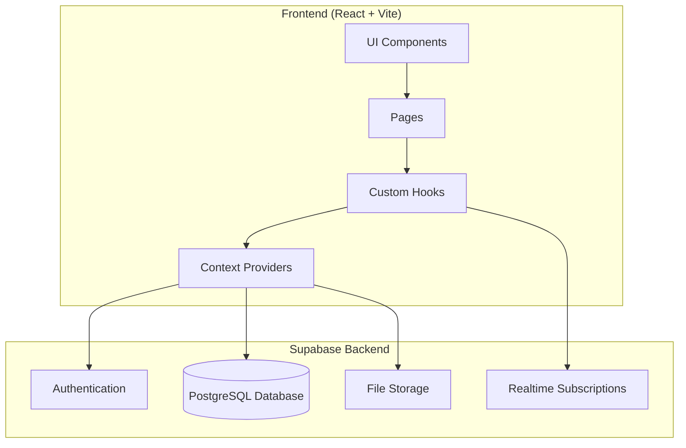
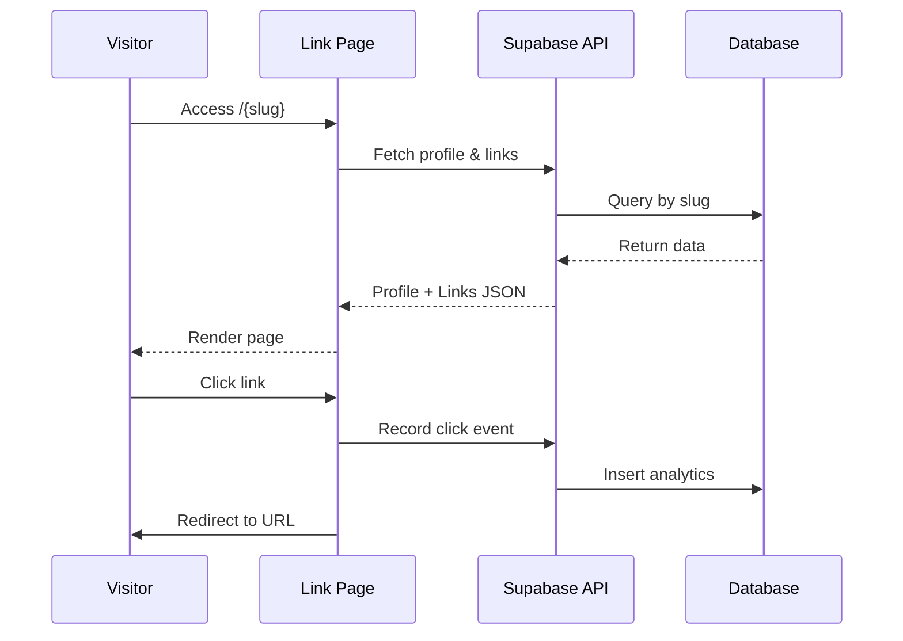

# Design Document - Linktree Clone

## Overview

Website personal link aggregator yang memungkinkan pengguna menyimpan, mengelola, dan membagikan koleksi link melalui satu URL. Aplikasi ini dibangun menggunakan React dengan TypeScript untuk frontend, Supabase untuk backend (database PostgreSQL + authentication + storage), dan Tailwind CSS untuk styling modern.

### Tech Stack
- **Frontend**: React 18 + TypeScript + Vite
- **Styling**: Tailwind CSS + Framer Motion (animations)
- **Backend**: Supabase (PostgreSQL, Auth, Storage)
- **Icons**: Lucide React
- **State Management**: React Context + React Query
- **Testing**: Vitest + fast-check (property-based testing)

## Architecture



### Application Flow



## Components and Interfaces

### Page Components

```typescript
// src/pages/LinkPage.tsx - Public link page
interface LinkPageProps {
  slug: string;
}

// src/pages/Dashboard.tsx - Admin dashboard
interface DashboardProps {
  userId: string;
}

// src/pages/NotFound.tsx - 404 page
```

### UI Components

```typescript
// src/components/LinkCard.tsx
interface LinkCardProps {
  link: LinkItem;
  onClick: () => void;
  isAnimated?: boolean;
}

// src/components/ProfileHeader.tsx
interface ProfileHeaderProps {
  profile: Profile;
  theme: Theme;
}

// src/components/SearchBar.tsx
interface SearchBarProps {
  value: string;
  onChange: (value: string) => void;
  placeholder?: string;
}

// src/components/SharedNotepad.tsx
interface SharedNotepadProps {
  slug: string;
  initialContent: string;
  maxLength: number;
}

// src/components/ThemeToggle.tsx
interface ThemeToggleProps {
  isDark: boolean;
  onToggle: () => void;
}

// src/components/IconPicker.tsx
interface IconPickerProps {
  selectedIcon: string;
  onSelect: (icon: string) => void;
  allowCustomUrl: boolean;
}

// src/components/LinkForm.tsx
interface LinkFormProps {
  link?: LinkItem;
  onSubmit: (data: LinkFormData) => void;
  onCancel: () => void;
}

// src/components/AnalyticsSummary.tsx
interface AnalyticsSummaryProps {
  totalViews: number;
  totalClicks: number;
  linkStats: LinkAnalytics[];
}


// src/components/DraggableLinkList.tsx
interface DraggableLinkListProps {
  links: LinkItem[];
  onReorder: (links: LinkItem[]) => void;
  onEdit: (link: LinkItem) => void;
  onDelete: (linkId: string) => void;
  onToggle: (linkId: string, enabled: boolean) => void;
}
```

### Service Interfaces

```typescript
// src/services/linkService.ts
interface LinkService {
  getLinks(userId: string): Promise<LinkItem[]>;
  createLink(link: CreateLinkInput): Promise<LinkItem>;
  updateLink(linkId: string, data: UpdateLinkInput): Promise<LinkItem>;
  deleteLink(linkId: string): Promise<void>;
  reorderLinks(userId: string, linkIds: string[]): Promise<void>;
}

// src/services/profileService.ts
interface ProfileService {
  getProfileBySlug(slug: string): Promise<Profile | null>;
  updateProfile(userId: string, data: UpdateProfileInput): Promise<Profile>;
  checkSlugAvailability(slug: string): Promise<boolean>;
  uploadAvatar(userId: string, file: File): Promise<string>;
}

// src/services/analyticsService.ts
interface AnalyticsService {
  recordPageView(slug: string): Promise<void>;
  recordLinkClick(linkId: string): Promise<void>;
  getAnalytics(userId: string): Promise<AnalyticsData>;
}

// src/services/notepadService.ts
interface NotepadService {
  getNoteContent(slug: string): Promise<string>;
  saveNoteContent(slug: string, content: string): Promise<void>;
  clearNote(slug: string): Promise<void>;
}

// src/services/exportService.ts
interface ExportService {
  exportUserData(userId: string): Promise<ExportData>;
  generateExportFile(data: ExportData, slug: string): Blob;
}
```

## Data Models

### Database Schema (Supabase PostgreSQL)

```sql
-- Users/Profiles table
CREATE TABLE profiles (
  id UUID PRIMARY KEY REFERENCES auth.users(id),
  slug VARCHAR(50) UNIQUE NOT NULL,
  display_name VARCHAR(100) NOT NULL,
  bio VARCHAR(150),
  avatar_url TEXT,
  theme_color VARCHAR(7) DEFAULT '#3B82F6',
  background_type VARCHAR(20) DEFAULT 'solid',
  background_value VARCHAR(100) DEFAULT '#ffffff',
  created_at TIMESTAMP WITH TIME ZONE DEFAULT NOW(),
  updated_at TIMESTAMP WITH TIME ZONE DEFAULT NOW()
);

-- Links table
CREATE TABLE links (
  id UUID PRIMARY KEY DEFAULT gen_random_uuid(),
  user_id UUID REFERENCES profiles(id) ON DELETE CASCADE,
  title VARCHAR(100) NOT NULL,
  url TEXT NOT NULL,
  icon_type VARCHAR(20) DEFAULT 'predefined',
  icon_value VARCHAR(255) NOT NULL,
  display_order INTEGER NOT NULL,
  is_enabled BOOLEAN DEFAULT true,
  click_count INTEGER DEFAULT 0,
  created_at TIMESTAMP WITH TIME ZONE DEFAULT NOW(),
  updated_at TIMESTAMP WITH TIME ZONE DEFAULT NOW()
);

-- Analytics events table
CREATE TABLE analytics_events (
  id UUID PRIMARY KEY DEFAULT gen_random_uuid(),
  profile_id UUID REFERENCES profiles(id) ON DELETE CASCADE,
  link_id UUID REFERENCES links(id) ON DELETE CASCADE,
  event_type VARCHAR(20) NOT NULL, -- 'page_view' or 'link_click'
  created_at TIMESTAMP WITH TIME ZONE DEFAULT NOW()
);

-- Shared notepad table
CREATE TABLE notepads (
  id UUID PRIMARY KEY DEFAULT gen_random_uuid(),
  slug VARCHAR(50) UNIQUE NOT NULL,
  content TEXT DEFAULT '',
  updated_at TIMESTAMP WITH TIME ZONE DEFAULT NOW()
);

-- Indexes for performance
CREATE INDEX idx_links_user_id ON links(user_id);
CREATE INDEX idx_links_display_order ON links(user_id, display_order);
CREATE INDEX idx_analytics_profile ON analytics_events(profile_id);
CREATE INDEX idx_analytics_link ON analytics_events(link_id);
CREATE INDEX idx_profiles_slug ON profiles(slug);
```

### TypeScript Types

```typescript
// src/types/index.ts

interface Profile {
  id: string;
  slug: string;
  displayName: string;
  bio: string | null;
  avatarUrl: string | null;
  themeColor: string;
  backgroundType: 'solid' | 'gradient' | 'image';
  backgroundValue: string;
  createdAt: string;
  updatedAt: string;
}

interface LinkItem {
  id: string;
  userId: string;
  title: string;
  url: string;
  iconType: 'predefined' | 'custom';
  iconValue: string;
  displayOrder: number;
  isEnabled: boolean;
  clickCount: number;
  createdAt: string;
  updatedAt: string;
}

interface Theme {
  primaryColor: string;
  backgroundType: 'solid' | 'gradient' | 'image';
  backgroundValue: string;
  isDarkMode: boolean;
}

interface AnalyticsData {
  totalViews: number;
  totalClicks: number;
  linkStats: LinkAnalytics[];
}

interface LinkAnalytics {
  linkId: string;
  title: string;
  clickCount: number;
}

interface ExportData {
  profile: Profile;
  links: LinkItem[];
  exportedAt: string;
}

// Form input types
interface CreateLinkInput {
  userId: string;
  title: string;
  url: string;
  iconType: 'predefined' | 'custom';
  iconValue: string;
}

interface UpdateLinkInput {
  title?: string;
  url?: string;
  iconType?: 'predefined' | 'custom';
  iconValue?: string;
  isEnabled?: boolean;
}

interface UpdateProfileInput {
  displayName?: string;
  bio?: string;
  slug?: string;
  themeColor?: string;
  backgroundType?: string;
  backgroundValue?: string;
}
```


## Correctness Properties

*A property is a characteristic or behavior that should hold true across all valid executions of a system-essentially, a formal statement about what the system should do. Properties serve as the bridge between human-readable specifications and machine-verifiable correctness guarantees.*

### Property 1: Link Addition Grows List
*For any* valid link data (title, URL, icon), adding it to a user's link collection SHALL result in the link being present in the collection and the collection size increasing by one.
**Validates: Requirements 1.1**

### Property 2: Link Deletion Removes from List
*For any* link collection and any link within it, deleting that link SHALL result in the link no longer being present in the collection and the collection size decreasing by one.
**Validates: Requirements 1.3**

### Property 3: Link Reorder Preserves Content
*For any* link collection and any permutation of that collection, reordering SHALL preserve all links (same content, same count) while changing only their display order.
**Validates: Requirements 1.4**

### Property 4: URL Validation Rejects Invalid URLs
*For any* string that does not match a valid URL pattern (missing protocol, invalid characters, malformed structure), the system SHALL reject it as an invalid URL.
**Validates: Requirements 1.5**

### Property 5: Disabled Links Hidden from Public View
*For any* link collection containing both enabled and disabled links, the public view SHALL only include links where isEnabled is true.
**Validates: Requirements 1.7**

### Property 6: Bio Length Validation
*For any* bio text, if the length exceeds 150 characters, the system SHALL reject the update; if within limit, the system SHALL accept and persist it.
**Validates: Requirements 2.2**

### Property 7: Slug Uniqueness Enforcement
*For any* two users attempting to use the same slug, only the first SHALL succeed; subsequent attempts SHALL be rejected with an error.
**Validates: Requirements 2.5**

### Property 8: Profile Retrieval by Slug
*For any* valid slug in the system, fetching the profile by that slug SHALL return the correct profile data; for invalid slugs, it SHALL return null/error.
**Validates: Requirements 3.1, 3.4**

### Property 9: Search Filter Correctness
*For any* link collection and any search query, the filtered results SHALL contain only links whose titles include the search text (case-insensitive).
**Validates: Requirements 3.6**

### Property 10: Notepad Content Persistence Round-Trip
*For any* notepad content within the character limit, saving and then retrieving SHALL return content equivalent to the original input.
**Validates: Requirements 9.2, 9.3**

### Property 11: Notepad Character Limit Enforcement
*For any* text exceeding 5000 characters, the system SHALL prevent saving and enforce the character limit.
**Validates: Requirements 9.6**

### Property 12: Analytics Counter Increment
*For any* page view or link click event, recording the event SHALL increment the respective counter by exactly one.
**Validates: Requirements 6.1, 6.2**

### Property 13: Link Data Serialization Round-Trip
*For any* valid LinkItem object, serializing to JSON and then deserializing SHALL produce an object equivalent to the original.
**Validates: Requirements 5.1, 5.2, 5.3**

### Property 14: Schema Validation Rejects Invalid Data
*For any* JSON data that does not conform to the expected schema (missing required fields, wrong types), the system SHALL reject it with a validation error.
**Validates: Requirements 5.4, 5.5**

### Property 15: Theme Settings Persistence
*For any* valid theme configuration (color, background type, background value), saving and retrieving SHALL return settings equivalent to the original.
**Validates: Requirements 7.1, 7.2, 7.3**

### Property 16: Dark Mode Preference Persistence
*For any* dark mode preference (true/false), storing in local storage and retrieving SHALL return the same preference value.
**Validates: Requirements 10.4, 10.5**

### Property 17: Export Data Completeness
*For any* user with profile and links, the export SHALL contain the complete profile data, all links with their settings, and a valid filename with slug and date.
**Validates: Requirements 8.1, 8.2, 8.3**

### Property 18: Open Graph Meta Tags Generation
*For any* profile with display name, bio, and avatar, the generated Open Graph meta tags SHALL include og:title, og:description, and og:image with correct values.
**Validates: Requirements 4.3**

## Error Handling

### Client-Side Errors
| Error Type | Handling Strategy |
|------------|-------------------|
| Invalid URL format | Display inline validation error, prevent submission |
| Bio exceeds limit | Show character counter, prevent submission when exceeded |
| Duplicate slug | Display error message, suggest alternatives |
| Network failure | Show toast notification, retry option |
| File upload failure | Display error, allow retry |

### Server-Side Errors
| Error Type | HTTP Status | Response |
|------------|-------------|----------|
| Profile not found | 404 | Redirect to 404 page |
| Unauthorized | 401 | Redirect to login |
| Validation error | 400 | Return field-specific errors |
| Server error | 500 | Generic error message, log details |

### Data Validation
```typescript
// src/utils/validation.ts
const urlPattern = /^https?:\/\/.+\..+/;

function validateUrl(url: string): boolean {
  return urlPattern.test(url);
}

function validateBio(bio: string): { valid: boolean; error?: string } {
  if (bio.length > 150) {
    return { valid: false, error: 'Bio must be 150 characters or less' };
  }
  return { valid: true };
}

function validateSlug(slug: string): { valid: boolean; error?: string } {
  const slugPattern = /^[a-z0-9-]+$/;
  if (!slugPattern.test(slug)) {
    return { valid: false, error: 'Slug can only contain lowercase letters, numbers, and hyphens' };
  }
  if (slug.length < 3 || slug.length > 50) {
    return { valid: false, error: 'Slug must be between 3 and 50 characters' };
  }
  return { valid: true };
}
```

## Testing Strategy

### Unit Testing (Vitest)
- Test individual utility functions (validation, formatting)
- Test React hooks in isolation
- Test service layer functions with mocked Supabase client

### Property-Based Testing (fast-check)
- Library: `fast-check` for JavaScript/TypeScript
- Minimum iterations: 100 per property test
- Each property test MUST be tagged with: `**Feature: linktree-clone, Property {number}: {property_text}**`

Example property test structure:
```typescript
import * as fc from 'fast-check';
import { describe, it, expect } from 'vitest';

describe('Link Management Properties', () => {
  // **Feature: linktree-clone, Property 1: Link Addition Grows List**
  it('adding a link increases collection size by one', () => {
    fc.assert(
      fc.property(
        fc.array(linkArbitrary),
        fc.record({ title: fc.string(), url: validUrlArbitrary, icon: fc.string() }),
        (existingLinks, newLink) => {
          const result = addLink(existingLinks, newLink);
          return result.length === existingLinks.length + 1;
        }
      ),
      { numRuns: 100 }
    );
  });
});
```

### Integration Testing
- Test Supabase queries with test database
- Test component rendering with React Testing Library
- Test user flows (add link, edit profile, etc.)

### Test File Structure
```
src/
├── __tests__/
│   ├── properties/
│   │   ├── link.property.test.ts
│   │   ├── profile.property.test.ts
│   │   ├── notepad.property.test.ts
│   │   ├── analytics.property.test.ts
│   │   ├── serialization.property.test.ts
│   │   └── export.property.test.ts
│   ├── unit/
│   │   ├── validation.test.ts
│   │   └── utils.test.ts
│   └── integration/
│       └── services.test.ts
```
